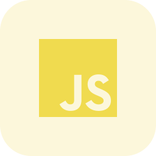
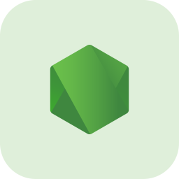

 

# Hey There, I'm Keyhan!

  

 
 

### Languages and Tools

  <a href="https://www.w3schools.com/c/" target="_blank">
  <a href="https://go.dev/" target="_blank">
  <a href="https://developer.mozilla.org/en-US/docs/Web/JavaScript" target="_blank">
  <a href="https://www.python.org/" target="_blank">
  <a href="https://www.typescriptlang.org/" target="_blank">
  <a href="https://nodejs.org/" target="_blank">
  <a href="https://www.mongodb.com/" target="_blank"> 
  <a href="https://git-scm.com/" target="_blank"> 
  <a href="https://github.com/" target="_blank"> 

 
 

### Softwares

  <a href="https://code.visualstudio.com/" target="_blank">
  <a href="https://www.jetbrains.com/idea/" target="_blank"> 
  
  

 
 

<h1> Stats </h1>

   
  
  
  

<!--

-->
